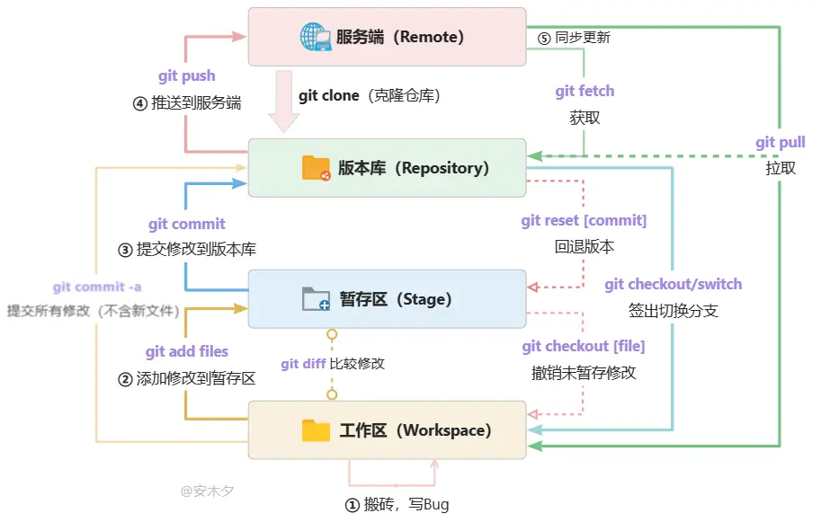

# 文档编写流程
文档全部托管于私有化部署的Gitea仓库上
使用Git进行权限管理，并使用Gitea的Webhook机制，实现文档自动编译和部署。
## 流程图

当然 只是简单的编写文档并不需要你掌握复杂的Git知识，你所需要掌握的只有
- 如何提交更改
- 如何创建PR
- 简单了解何为分支
- 如何回退提交
- 如何解决冲突
接下来我将会介绍如何进行提交更改，如何创建PR，如何解决冲突。
### 提交更改
在完成你的编辑后，你可以直接提交更改。
提交更改分为两步：
1. 提交更改
2. 推送更改

需要注意的时提交更改时需要有一条提交信息。这条信息应保持简短，且包含对更改的描述。  
如：```新增：对校园网的介绍``` ```更新：对校园网使用说明的修改``` ```删除：对校园网使用说明中关于新旧校园网的描述```
提交更改后，你需要推送更改到远程仓库。
